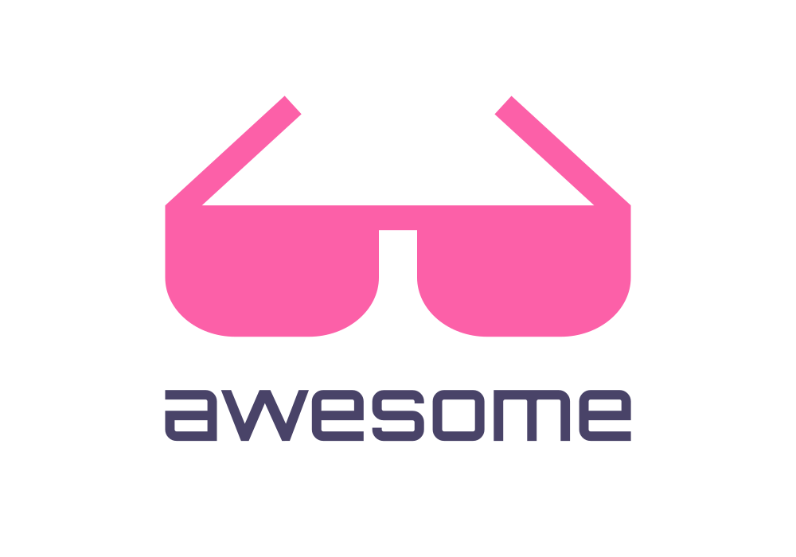

# Awesome TouchDesigner 

A curated collection of high-quality TouchDesigner resources for creators, artists, and developers. This list is regularly updated with tutorials, plugins, community projects, and inspiring works—all designed to help you push your creative boundaries.

---

## Table of Contents
- [1. Introduction & Official Resources](#1-introduction--official-resources)
- [2. Learning Resources](#2-learning-resources)
  - [Tutorials & Video Playlists](#tutorials--video-playlists)
    - [Tutorials](#tutorials)
    - [YouTube Channels](#youtube-channels)
    - [Playlists & Courses](#playlists--courses)
  - [Cheat Sheets & Guides](#cheat-sheets--guides)
- [3. Projects, Tools, & Community Assets](#3-projects-tools--community-assets)
  - [Plugins & Tools](#plugins--tools)
  - [Assets & Marketplaces](#assets--marketplaces)
  - [Community Projects & Repositories](#community-projects--repositories)
- [4. Inspiration & Creative Techniques](#4-inspiration--creative-techniques)
  - [Generative Art](#generative-art)
  - [Audio-Visual Integration](#audio-visual-integration)
  - [VJing](#vjing)
- [5. Community & Social Engagement](#5-community--social-engagement)
  - [Forums & Groups](#forums--groups)
  - [Social Media & Showcases](#social-media--showcases)
- [6. Blogs, Articles, & Media](#6-blogs-articles--media)
- [7. Events, Meetups & Newsletters](#7-events-meetups--newsletters)
  - [Events & Meetups](#events--meetups)
  - [Newsletter & Media](#newsletter--media)
- [8. Artists & Studios](#8-artists--studios)
  - [Featured Artists](#featured-artists)
  - [Studios](#studios)
- [9. Other VJing Software](#9-other-vjing-software)
- [10. Contributing & License](#10-contributing--license)

---

## 1. Introduction & Official Resources

### Summary
TouchDesigner is a powerful visual development platform for real-time interactive multimedia content. This section offers essential starting points and official materials.

### Official Links
- [derivative.ca](https://derivative.ca)
- [TouchDesigner Documentation](https://docs.derivative.ca/Main_Page)
- [Download TouchDesigner](https://derivative.ca/download)
- [TouchDesigner Forum](https://forum.derivative.ca)

---

## 2. Learning Resources

### Tutorials & Video Playlists

#### Tutorials
- [TouchDesigner Tutorials - Official Documentation](https://docs.derivative.ca/Category:Tutorials)
- [Custom Operators](https://derivative.ca/UserGuide/Custom_Operators)
- [Matthew Ragan's TouchDesigner Tutorials](https://matthewragan.com/teaching-resources/touchdesigner/)
- [Interactive & Immersive HQ Tutorials](https://interactiveimmersive.io/)
- [Morphing between Objects](https://www.youtube.com/watch?v=2EwQSCZ0Hs8)
- [Particle Clouds and Pseudo-Plexus](https://www.youtube.com/watch?v=ZgYxo6o-o9s)
- [Interactive Particles using particlesGpu](https://www.youtube.com/watch?v=NnrWjQ_zO-s)
- [Generate Shapes from an Image](https://www.youtube.com/watch?v=98xNOgU1zeI)
- [Pointclouds and Chromatic Aberration](https://www.youtube.com/watch?v=E6yRczNElTk)
- [Particle Flow and Energy Absorption](https://www.youtube.com/watch?v=zcaA8JvOSEM)
- [Custom Interactive 3D Particle System](https://www.youtube.com/watch?v=NuIShUTg3nI)
- [Sketchy Toon Shader](https://www.youtube.com/watch?v=VDBja6o8yvs)
- [Trace and Blob Tracking Effect](https://www.youtube.com/watch?v=qH94dipCJiw)
- [Audio-Reactive Psychedelic Visuals](https://www.youtube.com/watch?v=Mt2hwb5cngA)
- [Particle Attractors](https://youtube.com/watch?v=dzYyrvyY-zc&si=8aLXxedJflzaQfDQ)
- [Make Anything Audio Reactive](https://www.youtube.com/watch?v=rGoCbVmGtPE)
- [How to Dithering](https://www.youtube.com/watch?v=nOYQGxdpYgw)
- [What is Generative Art: TouchDesigner’s Role in Art, Algorithms, and Creative Systems Explained](https://www.youtube.com/watch?v=1RD83NjwNIk)
- [Video to ParticlesGPU](https://www.youtube.com/watch?v=hrxn_ouFyV0)
- [Simon Alexander Adams's Tutorials](https://www.simonaa.media/tutorials-articles)
- [Working with Midi](https://www.youtube.com/watch?v=XLeghJmFBh0)
- [3D Laser scanning dissipation](https://www.youtube.com/watch?v=Nqg8T4FtbRE)
- [Mouse Attracted Particles](https://www.youtube.com/watch?v=0Obt8aL8G10)
- [Learn TouchDesigner in 1 Hour (TouchDesigner for Beginners)](https://www.youtube.com/watch?v=gQdmocb-JBQ)

### YouTube Channels
- [TouchDesigner Official](https://www.youtube.com/@TouchDesignerOfficial)
- [Interactive & Immersive HQ](https://www.youtube.com/@TheInteractiveImmersiveHQ)
- [Reflekkt](https://www.youtube.com/@reflekkt_net)
- [exsstas](https://www.youtube.com/@exsstas)
- [DeanCheesman](https://www.youtube.com/@DeanCheesman)
- [Acrylicode](https://www.youtube.com/@acrylicode)
- [Matthew Ragan](https://www.youtube.com/@raganmd)
- [Luchen Xi - Alexxi](https://www.youtube.com/@Alexxi-generativeartist)
- [Lake Heckaman](https://www.youtube.com/@water__shed/playlists)
- [bileam tschepe (elekktronaut)](https://www.youtube.com/@elekktronaut)
- [PPPANIK](https://www.youtube.com/@pppanik)
- [DotSimulate](https://www.patreon.com/dotsimulate)

### Playlists & Courses
- [Official Tutorials Playlist](https://www.youtube.com/playlist?list=PLzmoq9o8x48F3QEy2VGrakgP2p8gP4pqa)
- [Matthew Ragan's In-Depth Tutorials](https://matthewragan.com/teaching-resources/touchdesigner/)
- [Summit Berlin 2018](https://www.youtube.com/playlist?list=PLSqkC3f_BStzZ9CyGW9ahN8Sb_zoCWak1)
- [Workshop Norway 2016](https://www.youtube.com/watch?v=fgs6DVdUkM0&list=PLSqkC3f_BStweh-7ZF8L3oyeJWLP2aYTw)
- [TouchDesigner Beginner Course](https://www.youtube.com/playlist?list=PLFrhecWXVn5862cxJgysq9PYSjLdfNiHz)
- [The 100 Series: TouchDesigner Fundamentals](https://learn.derivative.ca/courses/100-fundamentals/)
- [A Deep Dive into the Core Knowledge of TouchDesigner](https://www.udemy.com/course/gem-seed_touchdesigner-course-continuous-course-updates/) *(paid)*
- [Learning Touchdesigner](https://bookstack.hku.nl/books/touchdesigner/page/learning-touchdesigner)
- [The NODE Institute](https://thenodeinstitute.org/) — Structured TouchDesigner courses with certification program.
- [Gray Area TD Intensive](https://grayarea.org/) — 12-week TouchDesigner course culminating in a public exhibition.

## Cheat Sheets & Guides
- [Common Operations Cheat Sheet](https://matthewragan.com/teaching-resources/touchdesigner/touchdesigner-common-operations-cheat-sheet/)
- [Python Cheat Sheet for TouchDesigner Developers](https://interactiveimmersive.io/blog/python/python-cheat-sheet-for-touchdesigner-developers/)
- [Python Cheat Sheet Part 2 (Intermediate)](https://interactiveimmersive.io/blog/python/python-touchdesigner-cheat-sheet-part-2-intermediate/)
- [Python in TouchDesigner | Extensions](https://matthewragan.com/2016/07/14/python-in-touchdesigner-extensions-touchdesigner/)
- [Understanding Extensions in TouchDesigner](https://matthewragan.com/2015/07/05/touchdesigner-understanding-extensions/)
- [TouchDesigner Keyboard Shortcuts](https://matthewragan.com/teaching-resources/touchdesigner/touchdesigner-keyboard-shortcuts/)
- [SOP Cheat Sheet](https://forum.derivative.ca/t/sop-cheat-sheet-w-pics-wiki-mode/275002)
- [MIDI Device Beginner Guide](https://interactiveimmersive.io/blog/controlling-touchdesigner/midi-device-beginner-guide/)
- [VJing tools and resources list](https://l68k.com/things/vjing)

---

## 3. Projects, Tools, & Community Assets

To help you extend and customize TouchDesigner, this section combines plugins, tools, assets, and community projects into one integrated resource.  

### Plugins & Tools
- [TDAbleton](https://github.com/search?q=TDAbleton) — Sync TouchDesigner with Ableton Live for integrated audio-visual performance.
- [Spout](http://spout.zeal.co/) — Windows framework for real-time video sharing between applications.
- [Syphon](http://syphon.v002.info/) — macOS framework enabling real-time video output between applications.
- [Rust Plugins](https://github.com/thatmarcel/touchdesigner-plugins) — Extend TouchDesigner functionality with plugins written in Rust.
- [Community Extensions](https://forum.derivative.ca) — User-contributed custom operators and tools.
- [Pixel Maps (Artio)](https://github.com/theexperiential/Artio) — Manage and manipulate pixel maps in your projects.
- [SOP To SVG Converter](https://github.com/raganmd/touchdesigner-sop-to-svg) — Convert SOP data into SVG for vector graphics workflows.
- [Constraint Simulation Tool](https://derivative.ca/community-post/asset/constraint-simulation-tool/65109) — Simulate dynamic constraints in TouchDesigner.
- [TD Script - Blender Add-on for TouchDesigner](https://www.youtube.com/watch?v=olRMbGqgxp0) - Integrate Blender with TouchDesigner
- [MediaPipe](https://github.com/torinmb/mediapipe-touchdesigner) - GPU Accelerated MediaPipe
- [GeoPix](https://github.com/EnviralDesign/GeoPix) - GeoPix is a free and open source real-time lighting control and previz software.
- [TouchDiffusion](https://github.com/olegchomp/TouchDiffusion) - Real-time Stable Diffusion interactive generation with StreamDiffusion
- [RayTK](https://github.com/t3kt/raytk) - Raymarching shader toolkit
- [Simple Mixer](https://github.com/Richard-Burns/SimpleMixer) - A Video mixer build in TouchDesigner.
- [touchFluid](https://github.com/kamindustries/touchFluid) - Fluids in TouchDesigner and GLSL
- [touchfluids](https://github.com/ancillarymagnet/touchfluids) - Newtonian fluids in TouchDesigner
- [TDComfyUI](https://github.com/olegchomp/TDComfyUI) - TouchDesigner interface for ComfyUI
- [TouchEngine-UE](https://github.com/TouchDesigner/TouchEngine-UE) - The TouchEngine-UE plugin allows UE developers to load TouchDesigner components within UE while relying on the TouchEngine API.
- [Style Transfer](https://github.com/exsstas/StyleTransfer-in-TD) - TensorFlow implementation of Neural Style Transfer in TouchDesigner
- [TDDiffusionAPI](https://github.com/olegchomp/TDDiffusionAPI) - TouchDesigner interface for AUTOMATIC1111
- [FunctionStore Tools](https://github.com/function-store/FunctionStore_tools) - TouchDesigner workflow tools and UX improvements and more
- [Luminosity](https://github.com/IntentDev/Luminosity) - Front-end for TouchDesigner aimed at providing operators with an efficient interface to perform, control, and distribute realtime media while retaining the open-ended programmability of TouchDesigner.
- [TD Completes Me](https://github.com/picturesbyrobots/td-completes-me) - A Simple Auto Completion Engine for Touch Designer
- [ShaderBuilder](https://github.com/satoruhiga/TouchDesigner-ShaderBuilder) - On the fly shader editing tool for TouchDesigner
- [PostEffects](https://github.com/yasuhirohoshino/TouchDesigner_PostEffects) - PostEffects for TouchDesigner
- [Shader Park](https://github.com/shader-park/shader-park-touchdesigner) - Render Shader Park sculptures in TouchDesigner
- [Image and Video Abstraction](https://github.com/yeataro/TD-Flow-ABS) - Real-time Flow-based Image and Video Abstraction in TouchDesigner. 
- [ISF TouchDesigner](https://github.com/marcinbiegun/isf-touchdesigner) - TouchDesigner component for working with ISF shader generators and filters
- [ShaderToyTouchdesigner](https://github.com/SebastienGravel/ShaderToyTouchdesigner) - Convert Shader Toy code for Touchdesigner
- [TouchDesigner Shared Components](https://github.com/DBraun/TouchDesigner_Shared) — Repository of shared components and project files.
- [TDComponents](https://github.com/dylanroscover/TDComponents) - A whimsical collection of everyday TouchDesigner components
- [tektshared](https://github.com/t3kt/tektshared) - Shared TouchDesigner components
- [TD Voronoi](https://github.com/yeataro/TD_Voronoi) - JFA Voronoi Video Filter in TouchDesigner
- [TDDepthAnything](https://github.com/olegchomp/TDDepthAnything) - TouchDesigner implementation for Depth Anything and TensorRT monocular depth estimation.
- [StreamDiffusionTD](https://dotsimulate.com/docs/streamdiffusiontd) — Real-time AI image generation using StreamDiffusion pipeline with SDXL and TensorRT support.
- [Terrain Tools](https://github.com/CraftKontrol/Terrain-Tools-for-Touchdesigner) — Game-engine-style environment creation with terrain shaders, volumetric fog, and boids system.
- [TouchPy](https://github.com/IntentDev/touchpy) — High-performance Python toolset with Vulkan/CUDA GPU-to-GPU zero-copy data transfers for ML pipelines.
- [TDYolo](https://github.com/patrickhartono/TDYolo) — YOLOv11 object detection with GPU acceleration on Windows (CUDA) and macOS (Metal).
- [TDNeuron](https://github.com/tdneuron/TDNeuron) — Native deep learning framework built entirely in GLSL shaders within TouchDesigner.

### Assets & Marketplaces
- [All TD](https://alltd.org/) — Comprehensive library of community-shared assets.
- [ChopChopChop](https://chopchopchop.org/) — Marketplace for curated TouchDesigner assets and components.
- [Palette](https://docs.derivative.ca/Palette) — Community-contributed TouchDesigner components and tools.
- [The Tox Market](https://thetoxmarket.com/) — Online market for .tox files and complete projects.

---

## 4. Inspiration & Creative Techniques

### Generative Art
- [Awesome Generative Art](https://github.com/kosmos/awesome-generative-art)
- [Awesome Creative Coding](https://github.com/terkelg/awesome-creative-coding)
- [Shaders For Absolute Beginners](https://clauswilke.com/art/post/shaders)

### Audio-Visual Integration
- [Awesome Audio Visualization](https://github.com/willianjusten/awesome-audio-visualization)

### VJing
- [Awesome VJing](https://github.com/LimeLimeW/awesome-vjing)

## Community Projects & Repositories
- [Awesome TouchDesigner (GitHub Search)](https://github.com/search?q=awesome+touchdesigner) — Discover community-curated repositories and lists.
- [TouchDesigner Playground](https://github.com/riebschlager/touchdesigner-playground) - A collection of TouchDesigner sketches.
- [TouchDesigner Research Repository](https://github.com/chungbwc/TouchDesigner) — Advanced research and explorations in TouchDesigner.
- [Generative Design Projects](https://github.com/TouchDesigner/GenerativeDesign) — Projects focused on generative design and creative coding.
- [TouchDesigner Experiments](https://github.com/davidedemarco/touchDesigner_experiments) — Experimental projects exploring innovative techniques.
- [TouchDesigner Projects Samples](https://github.com/knotidm/TouchDesigner-Projects/) — Sample projects showcasing creative applications.

---

## 5. Community & Social Engagement

### Forums & Groups
- [TouchDesigner Forum](https://forum.derivative.ca)
- [r/TouchDesigner on Reddit](https://www.reddit.com/r/TouchDesigner/)
- [Instagram (@touchdesigner)](https://www.instagram.com/touchdesigner)
- [TikTok](https://www.tiktok.com/search?q=touchdesigner)
- [TouchDesigner Slack](https://touchdesigner.slack.com/)
- [TouchDesigner Discord](https://discord.com/invite/senqbr2)

### Social Media & Showcases
- [Facebook Help Group](https://www.facebook.com/groups/touchdesignerhelp/)
- [Behance TouchDesigner Projects](https://www.behance.net/search/projects/touchdesigner)

---

## 6. Blogs, Articles & Media

- [Explore TouchDesigner on Medium](https://medium.com/tag/touchdesigner)
- [Official Learning Blog](https://learn.derivative.ca/)
- [Matthew Ragan's Blog](https://matthewragan.com/blog/)
- [TouchDesigner Resources by Matthew Ragan](https://matthewragan.com/teaching-resources/touchdesigner/)
- [Interactive Immersive](https://interactiveimmersive.io/blog/)

---

## 7. Events, Meetups & Newsletters

### Events & Meetups
- [TouchDesigner Meetups on Meetup.com](https://www.meetup.com/find/?keywords=touchdesigner)
- [Derivative Workshops & Events](https://derivative.ca/workshops-events)
- [Community Calendar on Forum](https://forum.derivative.ca)

---

## Newsletter & Media
- [Derivative Newsletter](https://derivative.ca/derivative-newsletter/subscription)
- [Interactive Immersive](https://interactiveimmersive.io/)

---

## 8. Artists & Studios

### Featured Artists
- [Pauric Freeman](https://www.instagram.com/pauric_freeman/)
- [ghostsmakemusic](https://www.instagram.com/ghostsmakemusic/)
- [gip.hy](https://www.instagram.com/gip.hy/)
- [Anastasia Lapotko](https://www.instagram.com/anastasialapotko/)
- [bonnie2.0.0](https://www.instagram.com/bonnie2.0.0/)
- [dith_idsgn](https://www.instagram.com/dith_idsgn/)
- [Jason Beyers](https://jasonbeyers.com/)
- [Cullen Hassel](https://www.instagram.com/cullenhassel/)
- [zpacetree](https://www.instagram.com/zpacetree)
- [fractaledvisions](https://www.instagram.com/fractaledvisions)
- [cerspense](https://www.instagram.com/cerspense)
- [Android Jones](https://androidjones.com/)
- [actualizevisuals](https://www.instagram.com/actualizevisuals)
- [Weidi Zang](https://www.instagram.com/w.e.i.d.i/)
- [Pieter Sistrom](https://www.instagram.com/archo_p/?hl=fr)
- [Simon AA](https://www.simonaa.media/)
- [Okamirufu](https://www.patreon.com/Okamirufu)
- [Torin Blankensmith](https://www.torinblankensmith.com/)
- [Glazov AV](https://www.instagram.com/glazov_av)
- [Luchen Xi - Alexxi](https://www.instagram.com/luchen_xi/)
- [NONOTAK](https://www.nonotak.com/) — Immersive light and sound installations.
- [TUNDRA](https://wearetundra.org/) — New media art collective working with A/V performances, light, and robotic art.

---

## Studios
- [Le Studio Dynamic](https://www.lestudiodynamic.com/)

---

## 9. Other VJing Software

- [vvvv](https://vvvv.org) - A visual live-programming environment that takes you from rapid prototyping to final production.
- [VJAMM](https://www.vjamm.com/) - A piano for sound and vision, audio visual performance software.
- [Zwobotmax.com](https://www.zwobotmax.com/) - Play videos and create visuals right inside Ableton Live.
- [MilkDrop3](https://github.com/milkdrop2077/MilkDrop3) - MilkDrop 3.0, supports any audio source, double-preset (.milk2), loading presets based on beat detection and much more...
- [VDMX6](https://www.vidvox.net/) - The ultimate real-time video playground for macOS just got a whole lot more ultimate.
- [Resolume](https://www.resolume.com/) - Resolume is the industry-leading software for VJ’s around the world.
- [HeavyM](https://www.heavym.net/vj-software/) - VJ software for projection mapping.
- [Modul8](https://www.garagecube.com/modul8/) - The pioneering macOS VJ application.
- [ArkaOS GrandVJ](https://vj.arkaos.com/grandvj/) - VJ software for live video performance.
- [Synesthesia](https://synesthesia.live/) - The All-in-One Music Visual Solution.
- [Millumin](https://www.millumin.com/v5/) - Complete solution to create Audiovisual Shows.
- [Lumen](lumen-app.com) - Video Synthesis On Your Mac.
- [Quantum VJ HD](https://www.warmplace.ru/soft/qvjhd/) - Simple glitch-style audio visualizer (video generator).
- [Noisedeck](https://noisedeck.app/) - An approachable, powerful video synth and a must-have for any creator's toolkit.
- [aNa](https://gitlab.com/metagrowing/ana) - A live coding system for visuals.
- [GoVJ](https://govjapp.com/) - Allows you to run your live visual mix, straight from your iPhone or iPad.
- [Magic](https://magicmusicvisuals.com/) - Fully-customizable and highly responsive visuals for live and recorded audio & MIDI.
- [Notch](https://www.notch.one/) — Real-time 3D motion graphics and VFX for live events and broadcast.

---

## 10. Contributing & License

### Contributing
Contributions are welcome! Submit a pull request or open an issue to help improve and expand this list.

---

## License

